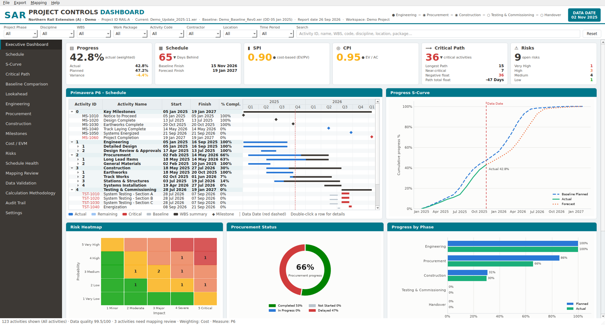

# SAR Project Controls Dashboard

Standalone Windows desktop application that imports two **Primavera P6 XER** files - the
**Approved Baseline** and the **Current Update** - and produces an auditable, management-level
Project Controls Dashboard. Primavera P6 is **not** required. Everything runs offline.



## Highlights

* **Native XER parser** - multiple P6 versions, encodings (UTF-8 / cp1252 / UTF-16), multi-project XERs, missing optional tables, 50k+ activities.
* **Centralized P6 field mapping** (`sar_pcd/core/xer_fields.py`) - every column documented with a verification status ([docs/XER_FIELD_MAPPING.md](docs/XER_FIELD_MAPPING.md)).
* **Semantic Schedule Mapping Engine** - classifies Engineering / Procurement / Construction / T&C / Handover (or your own categories) from WBS, names, codes, IDs, UDFs and logic, with **confidence scores**, evidence and a Mapping Review. Works on completely different naming conventions (tested with *Engineering/Procurement/Construction*, *Design/Supply Chain/Site Execution* and *ENG/MAT/CIVIL*). Keywords, synonyms, categories and overrides are editable and saved in reusable **mapping profiles**.
* **Baseline ↔ Current reconciliation** - Activity ID, then similarity (name, WBS, logic neighbours, duration, codes); Unchanged / Modified / Added / Deleted / Split / Potentially Renamed / Unmatched; uncertain matches are never forced.
* **KPIs** - weighted progress (Physical / Duration / Units; Cost / Resource / Duration / Count / Custom-UDF weights), planned progress at the Data Date, S-curve, SPI, CPI (only with actual cost), full EVM, critical path per the P6 project setting, Longest Path (P6 flag or traced), near-critical, negative float, variance analysis, 2/4/6/8-week lookahead, milestones, procurement / engineering / construction analytics, 5×5 risk heatmap (from an imported register only), DCMA-style schedule health and data validation.
* **Auditability** - click any KPI for formula, source, weighting, data date, baseline reference, overrides and the exact activities; audit trail of imports, overrides and settings.
* **Reports** - PDF Executive Dashboard and Full Report (A3/A4 landscape, SAR cover), Excel analysis / lookahead / critical / baseline comparison / health, high-resolution PNG.
* **Project workspaces** (`.sarpcd`, SQLite) - create, open, duplicate, archive; new updates keep the mapping profile.

## Quick start (from source)

```bash
pip install -r requirements.txt
python -m sar_pcd              # desktop app (use "Open Demo Project")
python -m sar_pcd demo --out samples
python -m sar_pcd analyze --baseline samples/Demo_Baseline_Rev0.xer --current samples/Demo_Update_2025-11.xer \
       --risks samples/Demo_Risk_Register.csv --pdf exec.pdf --pdf-full report.pdf --excel analysis.xlsx --png dash.png
```

Windows EXE and installer: see [docs/BUILD.md](docs/BUILD.md) (`build\build_windows.ps1`, or the GitHub Actions workflow).

## Documentation

| Document | |
|---|---|
| [User Guide](docs/USER_GUIDE.md) | Screens, workflow, exports, messages |
| [Architecture](docs/ARCHITECTURE.md) | Layers, data flow, mapping and matching algorithms, performance |
| [Calculation Methodology](docs/CALCULATION_METHODOLOGY.md) | Every KPI formula and rule |
| [XER Field Mapping](docs/XER_FIELD_MAPPING.md) | P6 tables/columns used, meaning and verification status |
| [Build Instructions](docs/BUILD.md) | EXE, installer, CI, signing |

## Repository layout

```
sar_pcd/core        XER parser, field map, loader, normalized model, dates/calendars
sar_pcd/mapping     text normalization, mapping profile (keyword dictionary), classifier
sar_pcd/analysis    matching, context, critical path, metrics/EVM, health, validation, changes, risk, filters
sar_pcd/services    import pipeline, dashboard assembly, SQLite workspace, safe serialization
sar_pcd/reporting   shared charts, dashboard image, PDF, Excel, SAR style/palette
sar_pcd/ui          PySide6 application (pages, widgets, wizard, dialogs)
sar_pcd/demo        CPM-based synthetic XER generator + demo rail project
sar_pcd/config      default_mapping_profile.json
tests/              pytest suite (parser, dates, mapping A/B/C, matching, calculations, services, UI smoke, performance)
samples/            demo baseline/current XER + sample risk register
build/              PyInstaller spec, version info, Inno Setup script, Windows build script
```

## Tests

```bash
QT_QPA_PLATFORM=offscreen python -m pytest -q
```

The demo project and all sample data are fictional.
